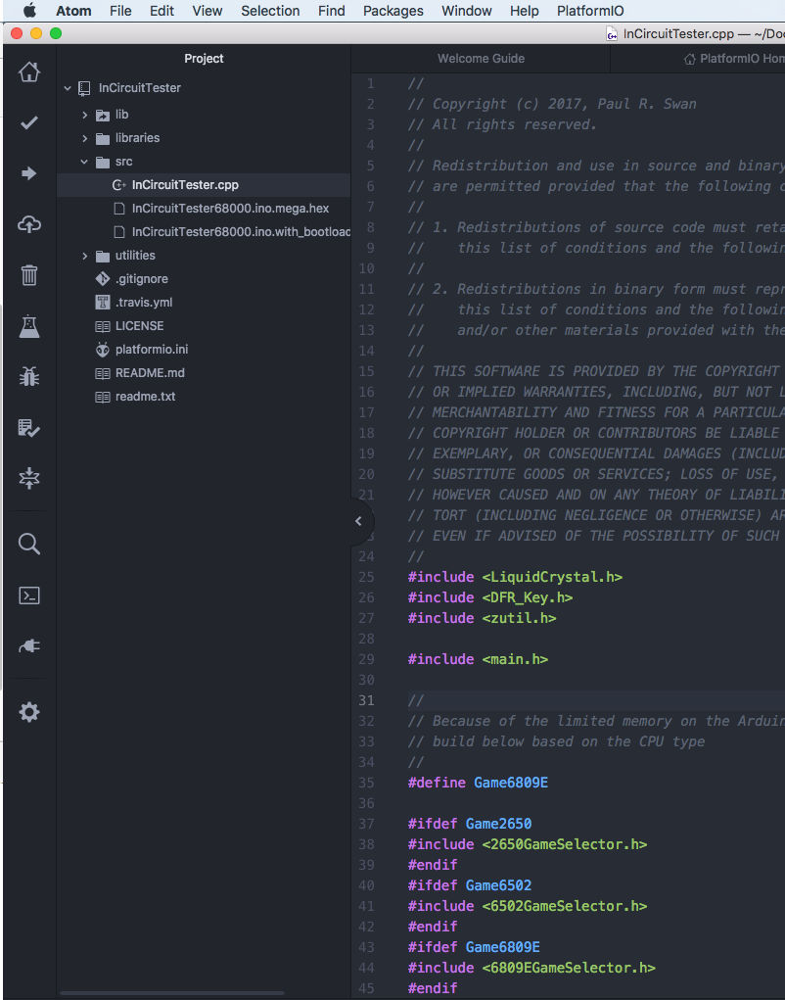

# Arduino ICT
An Arduino Mega based In Circuit Tester to aid in the repair of various 8-bit CPU systems, primarily targetting video arcade games.

Full details can be found: http://www.paulswan.me/arcade/ArduinoMegaICT.htm

# License
This software is licensed under the BSD-2 license except for the following:

1. "DFR_Key" source code is unattributed as recieved by the Arduino keypad/display manufacturer.

2. "crc32" source code is licensed under the ZLib license.

# Tool Chain
Atom - https://atom.io/
Platform.io - https://platformio.org/

# Defining systems to test
Rather than having separate compilations for each system, they are now defined using #ifdef statements in the main src/InCircuitTester.cpp file

Simple #define the platform you wish to compile for e.g.

#define Game6809E

Specifically the 6809E game system has it's own #ifdef for game subsets within it as the Arduino was crashing with all systems enabled in one go - I'm guessing perhaps as a memory error, but either way if works fine with only one or two sub-systems enabled
